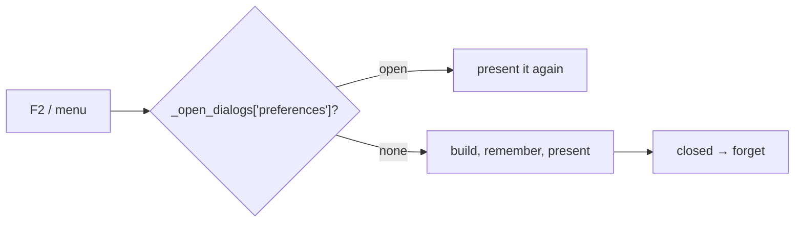

# Bug 23: Dialogs stack on every press

Plan: [plan/bugs/bug-23-preferences-and-other-dialogs-stack.md](../../plan/bugs/bug-23-preferences-and-other-dialogs-stack.md)

*Fixed.*

```mermaid
flowchart LR
    K["F2 / menu"] --> P{"_open_dialogs['preferences']?"}
    P -- "open" --> R["present it again"]
    P -- "none" --> B["build, remember, present"]
    B --> C["closed → forget"]
```
