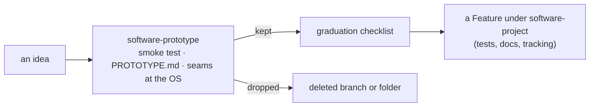

# Feature 37: The `software-prototype` skill

Plan: [plan/features/feature-37-software-prototype-skill.md](../../plan/features/feature-37-software-prototype-skill.md)

*Proposed.*

```mermaid
flowchart LR
    I["an idea"] --> P["software-prototype<br/>smoke test · PROTOTYPE.md · seams at the OS"]
    P -->|"kept"| G["graduation checklist"]
    G --> F["a Feature under software-project<br/>(tests, docs, tracking)"]
    P -->|"dropped"| X["deleted branch or folder"]
```
