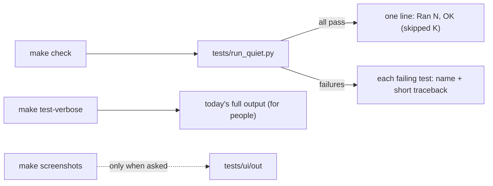

# Feature 38: Cheaper test runs

Plan: [plan/features/feature-38-cheaper-test-runs.md](../../plan/features/feature-38-cheaper-test-runs.md)

*Built (A and C).*

```mermaid
flowchart LR
    M["make check"] --> Q["tests/run_quiet.py"]
    Q -->|"all pass"| L["one line: Ran N, OK (skipped K)"]
    Q -->|"failures"| F["each failing test: name + short traceback"]
    V["make test-verbose"] --> FULL["today's full output (for people)"]
    S["make screenshots"] -.->|"only when asked"| PNG["tests/ui/out"]
```
